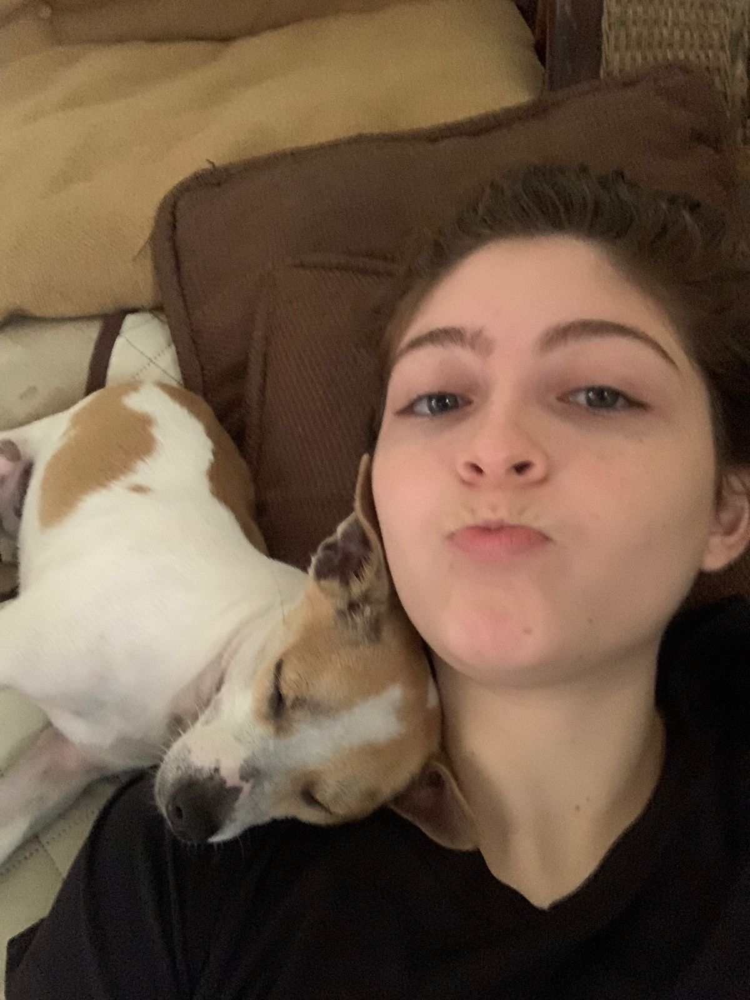

<html>
<head>
    <meta charset="UTF-8">
    <meta http-equiv="X-UA-Compatible" content="IE=edge">
    <meta name="viewport" content="width=device-width, initial-scale=1.0">
    <title>Alfsiezar GameDev</title>
    <link rel="stylesheet" href="styles.css">
</head>
<body>
    

        

            
        

        

            <button class = "TopbarButton" id = "ProjectsButton"> Projects </button>
            <button class = "TopbarButton" id = "AboutButton"> About Me </button>
            <button class = "TopbarButton" id = "ContactButton"> Contact Me </button>
        

    

    

        <h1 class = "Section">Projects</h1>

        

            

                
                <iframe 
                    class="video"
                    src="https://www.youtube.com/embed/QF7DXVjI0SA?si=0rZ_Qjwbm58X6fer" 
                    title="YouTube video player" 
                    frameborder="0" 
                    allow="accelerometer; autoplay; clipboard-write; encrypted-media; gyroscope; picture-in-picture; web-share" 
                    referrerpolicy="strict-origin-when-cross-origin" 
                    allowfullscreen>
                </iframe>
            

            <h2 class="ProjectTitle">Winter 1939</h2>
            
 
                "Winter 1939" is a VR game developed in Unreal Engine, 
                inspired by the legendary Finnish sniper Simo Häyhä. 
                This short demo offers a single game mode where your objective is to 
                eliminate as many enemies as possible before being overrun. 
                Created as a final graduation project by me and two colleagues, 
                the game is available for free to download on my itch.io page.
            

        

        

            

                
                <!--<iframe 
                    class="video"
                    src="https://www.youtube.com/embed/QF7DXVjI0SA?si=0rZ_Qjwbm58X6fer" 
                    title="YouTube video player" 
                    frameborder="0" 
                    allow="accelerometer; autoplay; clipboard-write; encrypted-media; gyroscope; picture-in-picture; web-share" 
                    referrerpolicy="strict-origin-when-cross-origin" 
                    allowfullscreen>
                </iframe>-->
            

            <h2 class="ProjectTitle">Zombie Survival</h2>
            
 
                "Zombie Survival" is a solo-developed first-person shooter where players face relentless waves of zombies 
                in a fight for survival. Every aspect of the game, from programming and enemy AI to art, design, and sound, 
                is being crafted by me, delivering an intense and immersive experience. Your mission: survive as 
                long as you can against the ever-growing horde.
            

        

    

    

        <h1 class = "Section">About Me</h1>
        

            
        

    

    

        <h1 class = "Section">Contact Me</h1>

    

    

</body>
</html>